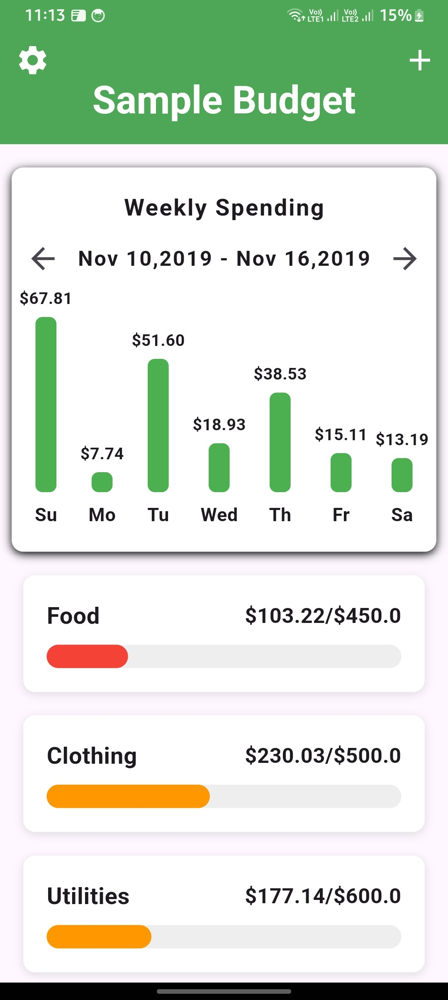

# 💸 Simple Budget UI

A clean, responsive, single-page **Budget Tracking UI** built for visualizing income, expenses, and remaining balance. Designed for simplicity and ease of integration.

## 🖼️ Preview



> _(Replace with your actual image path or URL)_

## ✨ Features

- 🧾 Displays total income, expenses, and balance
- 📊 Visual summary of spending categories
- 📱 Responsive and mobile-friendly layout
- 🎨 Clean and modern UI using Flutter (or React, etc.)

## 🚀 Getting Started

### Prerequisites

- [Flutter SDK](https://flutter.dev/docs/get-started/install) 
- A code editor like VS Code

### Run the Project

```bash
flutter run
